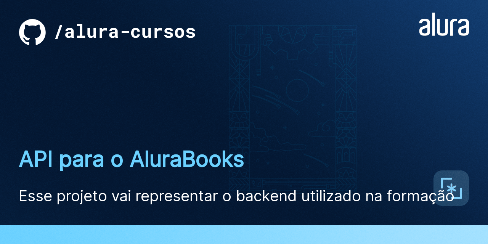
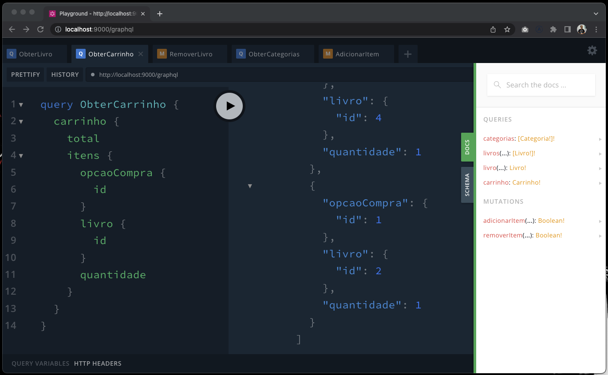

# AluraBooks

O AluraBooks é uma loja virtual que vende livros da Casa do Código. 
É um MVP que tá só começando e ainda tem muitas funcionalidades novas para serem desenvolvidas.

# JSONServer + JWT Auth + Nest & GraphQL

Essa é ma API Rest mockada, utilizando json-server e JWT.
Ao lado, temos um Apollo Server criado com a ajuda do Nest encapsulando as chamadas a API.




## 🛠️ Instalação

```bash
$ npm install
```

## 🛠️ Execução

Abra um terminal e execute o seguinte comando:

```bash
$ npm run start
```

Deixe o terminal anterior aberto, abra um novo terminal e execute:

```bash
$ npm run start:api
```

Agora sim, com os dois comando em execução está tudo pronto para o início do curso!


## 🛠️ Como se registrar?

Você pode fazer isso efetuando uma requisição post para:

```
POST http://localhost:8000/public/registrar
```

Com os seguintes dados:


```
{
    "nome": "vinicios neves",
    "email": "vinicios@alura.com.br",
    "senha": "123456",
    "endereco": "Rua Vergueiro, 3185",
    "complemento": "Vila Mariana",
    "cep": "04101-300"
}
```

Repare que o e-mail é um campo único e usuários com e-mails duplicados não serão persistidos.

## 🛠️ Como fazer login?

Você pode fazer isso efetuando uma requisição post para:

```
POST http://localhost:8000/public/login
```

Com os seguintes dados:


```
{
  "email": "vinicios@alura.com.br",
  "senha":"123456"
}
```

Você vai receber um token no seguinte formato:

```
{
   "access_token": "<ACCESS_TOKEN>",
   "user": { ... dados do usuário ... }
}
```

## Autenticar próximas requests?

E então, adicionar este mesmo token ao header das próximas requisições:

```
Authorization: Bearer <ACCESS_TOKEN>
```

## 📚 Mais informações do curso

O AluraBooks é o projeto utilizado durante toda a formação, e essa API será utilizada em vários cursos diferentes :)